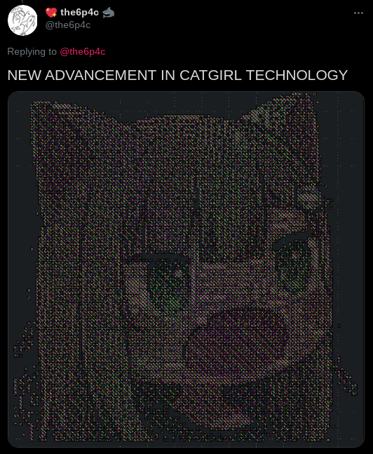

catgirltogds
============
converts catgirls to gds files



```
usage: catgirltogds.py [-h] [--rects] img [gds] [cell_name]

convert images (catgirls) to gds

positional arguments:
  img         image to convert
  gds         gds to export, default to image filename with gds extension
  cell_name   name of the cell, default to image filename

optional arguments:
  -h, --help  show this help message and exit
  --rects     try to use filling rects (vv slow)
```
